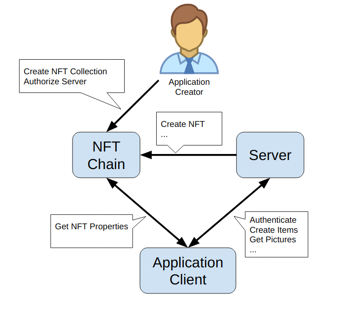
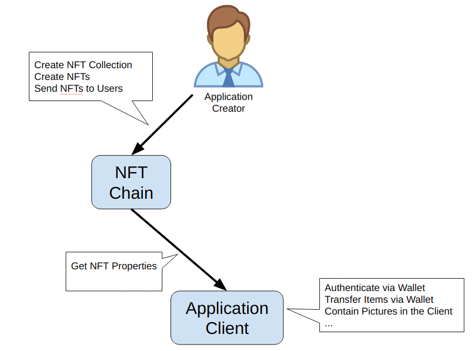

# Building an NFT Application

## Architecture

Both centralized and serverless architectures are supported and application creator can decide which one to use depending on how much logic and data they intend to manage off-chain and off-line.

### Server-based architecture

In server-based architecture the application creator manually creates NFT collections and authorizes server to perform operations on each collection. See NFT palette methods that have admin permission level to understand better what server (or administrators) can do.

### Serverless architecture

In serverless architecture the application creator does all initialization and token distribution manually. Alternatively, smart contracts may be used in order to implement some distribution mechanics such as token sales or claiming. The dApp has access to all properties of an NFT token, but it does not have any elevated permissions, since it resides on user site. All operations happen on user's behalf signed by user's private key.

## NFT Palette Methods

### Collection Management

#### CreateCollection

##### Description
This method creates a Collection of NFTs. Each Token may have multiple properties encoded as an array of bytes of certain length. The initial owner and admin of the collection are set to the address that signed the transaction. Both addresses can be changed later.

##### Permissions
Anyone

##### Parameters
customDataSz: Size of NFT properties data.

##### Events
CollectionCreated
CollectionID: Globally unique identifier of newly created collection.
Owner: Collection owner

#### ChangeCollectionOwner

##### Description
Change the owner of the collection

##### Permissions
Collection Owner

##### Parameters
CollectionId

#### DestroyCollection

##### Description
DANGEROUS: Destroys collection and all NFTs within this collection. Users irrecoverably lose their assets and may lose real money.

##### Permissions
Collection Owner

##### Parameters
CollectionId

#### CreateItem

##### Description
This method creates a concrete instance of NFT Collection created with CreateCollection method.

##### Permissions
Collection Owner
Collection Admin

##### Parameters
CollectionID: ID of the collection
Properties: Array of bytes that contains NFT properties. Since NFT Module is agnostic of properties’ meaning, it is treated purely as an array of bytes
Owner: Address, initial owner of the NFT

##### Events
ItemCreated
ItemId: Identifier of newly created NFT, which is unique within the Collection, so the NFT is uniquely identified with a pair of values: CollectionId and ItemId.

#### BurnItem

##### Description
This method destroys a concrete instance of NFT.

##### Permissions
Collection Owner
Collection Admin
Current NFT Owner

##### Parameters
CollectionID: ID of the collection
ItemID: ID of NFT to burn

##### Events
ItemDestroyed
CollectionID
ItemId: Identifier of burned NFT

#### AddCollectionAdmin

##### Description
NFT Collection can be controlled by multiple admin addresses (some which can also be servers, for example). Admins can issue and burn NFTs, as well as add and remove other admins, but cannot change NFT or Collection ownership.

This method adds an admin of the Collection.

##### Permissions
Collection Owner
Collection Admin

##### Parameters
CollectionID: ID of the Collection to add admin for
Admin: Address of new admin to add

#### RemoveCollectionAdmin

##### Description
Remove admin address of the Collection. An admin address can remove itself. List of admins may become empty, in which case only Collection Owner will be able to add an Admin.

##### Permissions
Collection Owner
Collection Admin

##### Parameters
CollectionID: ID of the Collection to remove admin for
Admin: Address of admin to remove

### Item Ownership and Transfers
This group of methods allows managing NFT ownership.

#### GetOwner

##### Description
Return the address of the NFT owner. 

##### Permissions
Anyone

##### Parameters
CollectionId
ItemId: ID of the NFT

##### Returns
Owner address

#### BalanceOf

##### Description
This method is included for compatibility with ERC-721. Return the total count of NFTs of a given Collection that belong to a given address. 

##### Permissions
Anyone

##### Parameters
CollectionId
Address to count NFTs for

##### Returns
Total count of NFTs for Address

#### Transfer

##### Description
Change ownership of the NFT.

##### Permissions
Collection Owner
Collection Admin
Current NFT owner

##### Parameters
Recipient: Address of token recipient
ClassId: ID of item class
ItemId: ID of the item

#### TransferFrom

##### Description
Change ownership of a NFT on behalf of the owner. See Approve method for additional information. After this method executes, the approval is removed so that the approved address will not be able to transfer this NFT again from this owner.

##### Permissions
Collection Owner
Collection Admin
Current NFT owner
Address approved by current NFT owner

##### Parameters
Recipient: Address of token recipient
ClassId: ID of item class
ItemId: ID of the item

#### Approve

##### Description
Set, change, or remove approved address to transfer the ownership of the NFT.

##### Permissions
Collection Owner
Collection Admin
Current NFT owner

##### Parameters
Approved: Address that is approved to transfer this NFT or zero (if needed to remove approval)
ClassId: ID of item class
ItemId: ID of the item

#### GetApproved

##### Description
Get the approved address for a single NFT.

##### Permissions
Anyone

##### Parameters
ClassId: ID of item class
ItemId: ID of the item

##### Returns
Approved address
