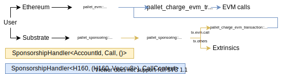

# Sponsoring

<!-- This SVG file can be opened and edited using draw.io -->

## Implementation

If you need to add sponsoring for pallet call, you should implement `SponsorshipHandler<AccountId, Call, ()>`

If you need to add sponsoring for EVM contract call, you should implement `SponsorshipHandler<H160, (H160, Vec<u8>), CallContext>`

For both examples, you can take a look at `UniqueSponsorshipHandler` struct inside of common runtime

## EVM bridging

In case if Ethereum call is being called using substrate `evm.call` extrinsic, `BridgeSponsorshipHandler` is used to convert between two different `SponsorshipHandler` types
